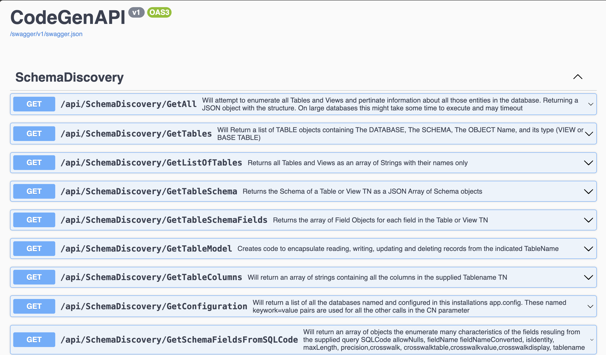

# CodeGenAPI
An API approach to my code generation tooling developed over the years

The Default ASP.NET Core project sets up a series of endpoints that can be used to generate code.
Employing SWAGGER to document the API and provide a UI for testing the API.

Example of the API in action
(

# Notes
YOU Might have to do
chrome://flags/#allow-insecure-localhost

to allow Insecure localhost crap
