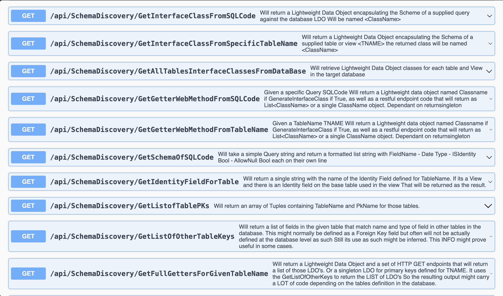
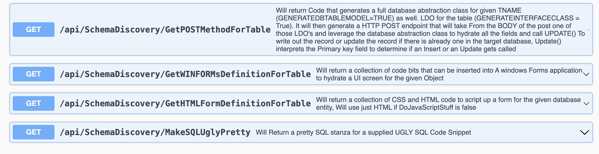

# CodeGenAPI
An API approach to my code generation tooling developed over the years

The Default ASP.NET Core project sets up a series of endpoints that can be used to generate code.
Employing SWAGGER to document the API and provide a UI for testing the API.

Example of the API in action

Most of the endpoints look for a parameter that represents the
connection string to the database.  
This can be a connection string or a name of a connection string in the appsettings.json file.  
(It looks for the supplied parameter starting with the typical bits of a full connection string. Otherwise it will try to find named connection string in the app settings file)

# Notes
YOU Might have to do
chrome://flags/#allow-insecure-localhost

to allow Insecure localhost crap
